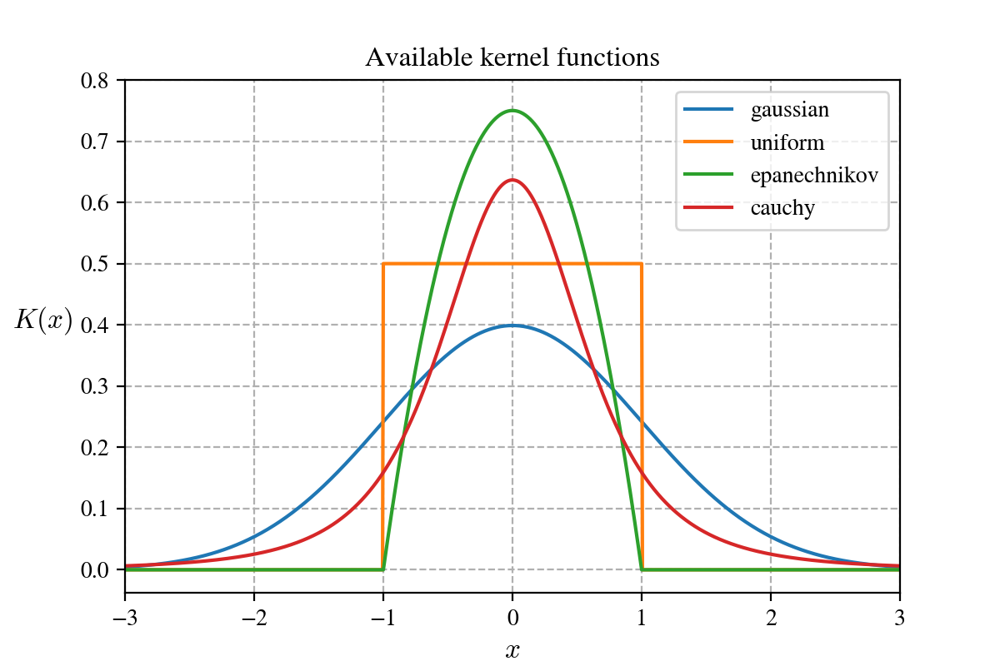

.. _density_estimation_desc:

#########################
Kernel density estimation
#########################

Kernel density estimation is a method for non-parametric density estimation.

In this page you can read about its :ref:`unconditional <unconditional>` (standard) and :ref:`conditional <conditional>` form.

.. _unconditional:

******************
Unconditional case
******************

Formula of unconditional kernel density estimation:

.. math::
    \hat{f}(x) = \sum_{i=1}^m w_{i} \prod_{j=i}^n \frac{1}{h_j} K \left( \frac{x_{j} - x_{i, j}}{h_j} \right) \text{,} \quad x \in \mathbb{R}^n

.. hlist::
    :columns: 2

    - :math:`m` - size of dataset
    - :math:`w` - weights of dataset
    - :math:`h` - bandwidth (smoothing parameter)
    - :math:`n` - dimensionality
    - :math:`K(x)` - kernel function

Check available :ref:`kernels <kernels>`.

Example of constructing kernel density estimation on small dataset (:math:`m=9`) with gaussian kernel:

.. _kernels:

Kernels
=======

There are four available kernel functions. See formulas and plot below:

.. table:: Formulas of available kernel functions
    :widths: auto
    :align: center

    ==============  =============================================================================
    Kernel name     Formula
    ==============  =============================================================================
    Gaussian        :math:`\frac{1}{\sqrt{2 \pi}} \exp \left( \frac{x^2}{2} \right)`
    Uniform         :math:`0.5 \quad \text{if } |x| \leq 1 \quad \text{otherwise } 0`
    Epanechnikov    :math:`\frac{3}{4} (1-x^2) \quad \text{if } |x| \leq 1 \quad \text{otherwise } 0`
    Cauchy          :math:`\frac{2}{\pi (x^2 + 1)^2}`
    ==============  =============================================================================

Weighted data
=============

Example of constructing kernel density estimation with weighted data points.

Notice that the rightmost data points have more impact on estimated density than others.

Bandwidth selection
===================

TODO

.. _conditional:

****************
Conditional case
****************